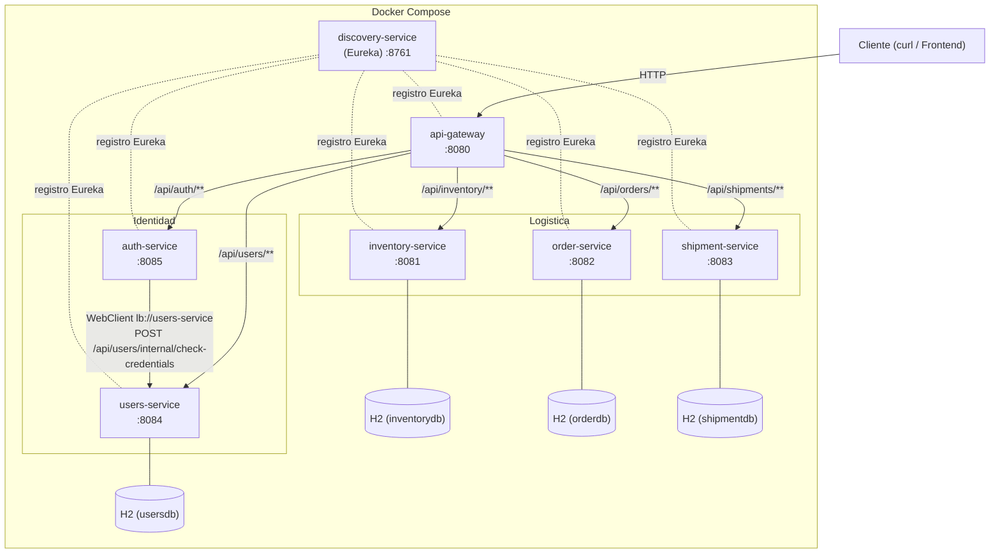
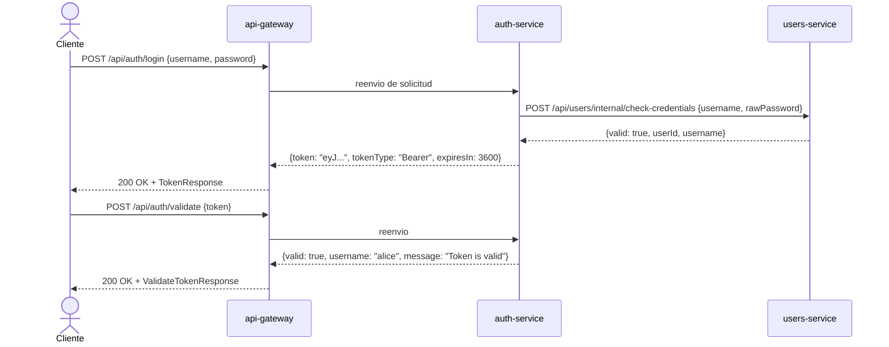

# Arquitectura de SmartLogix - Diagrama de Microservicios

## Diagrama de arquitectura (Mermaid)

## Flujo de autenticacion JWT

## Patrones de diseno aplicados

| Patron | Servicio | Descripcion |
|--------|----------|-------------|
| Repository | users-service | `UserRepository` extiende `JpaRepository` encapsulando acceso a datos |
| Strategy | auth-service | `TokenStrategy` interfaz con implementacion `JwtTokenStrategy`; permite cambiar el mecanismo de tokens sin modificar `AuthService` |
| Factory Method | shipment-service | `ShipmentPlanFactoryResolver` crea planes de envio por zona |
| Circuit Breaker | order-service | Resilience4j protege llamadas a shipment-service |
| Service Discovery | todos | Eureka registra y localiza servicios dinamicamente |
| API Gateway | api-gateway | Punto unico de entrada; enruta por path |
